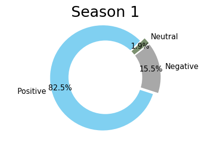
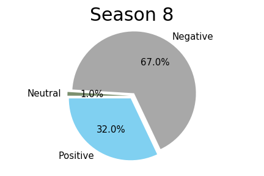
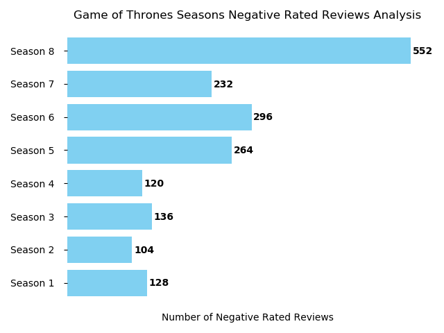

# SentimentAnalysisGOT
Sentiment analysis of user reviews

This project compared the difference between the 8 seasons of Game of Thrones. I wanted to see whether the last season of GOT had more negative reviews than the other seasons.

## Methodology
The data was collected from Metacritics. Using BeautifulSoup and Python, 824 user reviews was collected for all 8 season of Game of Thrones. Then VaderSentiment Analysis was implemented to perform the sentiment analysis.

## Results
Based on the results season 1 had a larger number of positive review score, 82.5%, then season 8 had a 32% positive score.

In fact, every season of GOT had more positive reviews than the 8th season.

Looking at the charts, season 2 actually had the lowest number of negative reviews with only 104. Season 8 had 552 negative reviews out of 824.

## Conclusion 
In conclusion, there was a difference in the sentiment analysis between the different seasons.

The main difference can be found in the later seasons (5-8). Especially with season 8 having the largest percentage of negative reviews.
